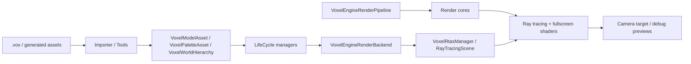

# VoxelEngine Architecture

## Scope

`Assets/VoxelEngine` is the production voxel engine tree. Experimental or
transitional code should stay outside this tree unless it has been promoted into
the formal engine pipeline.

The engine is currently organized around three stable runtime layers:

- `Data`: canonical voxel representations and serialized asset contracts
- `LifeCycle`: runtime residency, upload, retention, and release
- `Render`: render-facing aggregation, SRP execution, ray tracing, and debug UI

Editor-only importers and asset creation tools live beside those layers under
`Importer` and `Tools`.

## High-Level Flow



The important boundary is that data objects describe voxel content, lifecycle
managers make that content resident on the GPU, and the render backend turns
resident resources into the BLAS/RTAS-facing views consumed by SRP render
passes.

## Data Layer

`Assets/VoxelEngine/Data` owns stable engine-facing data contracts. It does not
own runtime residency or GPU lifetime.

`Data/Voxel` is the core voxel storage layer:

- `VoxelVolume` stores content in chunked 8x8x8 byte voxel blocks.
- Each chunk contains 512 voxel bytes and up to 16 AABB slots.
- `VoxelModel` packages one logical voxel object as an opaque volume plus a
  transparent volume.
- `VoxelPalette` stores exactly 256 packed RGBA colors.
- `VoxelModelAsset` and `VoxelPaletteAsset` are serialized ScriptableObject
  containers for Addressables.
- Serializer/helper types define the binary asset payloads and strong typed
  Addressables references.

`Data/VoxelWorldHierarchy` stores authored scene hierarchy data:

- `VoxelWorldHierarchy` is a ScriptableObject with imported node data and root
  node indices.
- Each `VoxelWorldHierarchyNode` stores local transform, hidden state, render
  offset, and optional model/palette references.
- The hierarchy is data only; registration into the render backend is performed
  by renderer-side runtime code.

## Import And Tooling

`Assets/VoxelEngine/Importer` contains editor import paths for MagicaVoxel-style
content and hierarchy extraction:

- `.vox` parsing and import-window code
- scene import data assembly
- chunk AABB optimization for the runtime voxel volume layout

`Assets/VoxelEngine/Tools` contains editor utilities that generate or inspect
engine assets, including primitive voxel asset windows, mesh-to-voxel asset
builders, palette creation tools, and hierarchy/AABB analysis windows.

These folders are authoring-time systems. Their output should be engine data
assets, not separate runtime representations.

## Lifecycle Layer

`Assets/VoxelEngine/LifeCycle` owns resource lifetime. It sits above `Data` and
below `Render`.

`LifeCycle/Manager` currently contains three manager families:

- `VoxelModelManager`: synchronous Addressables load, CPU deserialization, GPU
  buffer upload, handle-based retain/release, and model residency sharing.
- `VoxelPaletteManager`: equivalent residency flow for 256-color palette GPU
  buffers.
- `VoxelRtasManager`: procedural RTAS registration for backend-provided voxel
  BLAS views.

The current lifecycle path is synchronous. Model and palette acquisition finish
Addressables load, CPU staging, deserialization, GPU buffer creation, and CPU
staging release before returning.

`VoxelModelManager` uploads each model as two independent volume GPU views:

- opaque volume view
- transparent volume view

Each volume view owns the GPU buffers required by the procedural hit shader:

- `VolumeBuffer`
- `AabbDescBuffer`
- `AabbBuffer`

`VoxelRtasManager` does not define model or palette data. It receives an
assembled `VoxelBlasGpuView` from `RenderBackend`, selects the opaque or
transparent volume view, binds the model/palette buffers through a
`MaterialPropertyBlock`, and registers Unity `RayTracingAABBsInstanceConfig`
entries into a `RayTracingScene`.

RTAS masks are:

- opaque: `1 << 0`
- transparent: `1 << 1`
- debug AABB overlay: `1 << 2`
- all renderable voxel geometry: opaque + transparent

## Render Backend

`Assets/VoxelEngine/Render/RenderBackend` bridges lifecycle-managed GPU
resources into renderable instances.

`VoxelEngineRenderBackend` owns:

- `VoxelModelManager`
- `VoxelPaletteManager`
- `VoxelRtasManager`

`AddInstance(modelReference, paletteReference, localToWorld)` performs the full
render registration path:

1. Retain or load the model.
2. Retain or load the palette.
3. Assemble a `VoxelBlasGpuView` from the model and palette GPU views.
4. Register opaque volume data into RTAS when present.
5. Register transparent volume data into RTAS when present.
6. Return a `VoxelEngineRenderInstanceHandle` for later removal.

One logical render instance may therefore produce up to two RTAS instances:
one opaque and one transparent. Callers still treat the model as one object.

## Runtime Renderers

`Assets/VoxelEngine/Render/Renderer` contains scene-facing MonoBehaviours that
connect authored data to the backend.

`VoxelWorldHierarchyRenderer` is the current hierarchy renderer. At runtime it:

- loads a `VoxelWorldHierarchy` through Addressables
- walks root nodes recursively
- composes each node transform against the host GameObject transform
- skips hidden branches and nodes without renderable model/palette references
- registers renderable nodes into the active `VoxelEngineRenderBackend`
- releases backend handles when disabled, when the hierarchy changes, or when
  the backend changes

This keeps hierarchy traversal outside the core data classes and keeps backend
registration explicit.

## Render Pipeline

`Assets/VoxelEngine/Render/RenderPipeline` owns the Unity SRP entry point.

`VoxelEngineRenderPipelineAsset` is the serialized configuration root. It
stores shader/material references, sky settings, and serializable render core
configuration.

`VoxelEngineRenderPipeline` owns one `VoxelEngineRenderBackend` and drives the
active per-camera frame path. The current frame order is:

1. Set up camera properties and clear targets.
2. Decide whether final-color TAA should run.
3. Compute projection jitter when TAA is active.
4. Record `GbufferCore`.
5. Record `SunLightCore`; bind black sunlight on failure.
6. Record `ReflectionCore`; bind black reflection on failure.
7. Record `RtaoCore`.
8. Record `RtaoFrameAverageCore` for Game cameras when RTAO succeeded.
9. Record the selected debug or lit preview.
10. If enabled and preview target is `LitColor`, resolve final-color TAA and
    blit the TAA output to the camera target.
11. Release temporary render targets.
12. Draw gizmos in the editor and draw Unity UI overlay.

TAA is currently a final lit-color experiment. The projection jitter is shared
by gbuffer, sunlight, reflection, and RTAO passes so their reconstruction uses
the same camera sample position.

## Render Cores

`Assets/VoxelEngine/Render/Cores` contains small render-pass building blocks.
Each core records one concrete rendering step and should avoid owning global
resource residency.

Current active cores:

- `GbufferCore`: ray traces primary voxel hits and writes albedo,
  normal+roughness, hit distance, linear view-space depth, and motion.
- `SunLightCore`: ray traces direct directional sunlight from
  `RenderSettings.sun` or fallback sun settings.
- `ReflectionCore`: ray traces first-bounce reflection from the gbuffer surface,
  supports sky misses, and can spatially denoise the raw reflection.
- `RtaoCore`: traces cosine-weighted hemisphere AO rays from the gbuffer
  surface and writes average hit distance in world units.
- `RtaoFrameAverageCore`: converts AO hit distance into raw lighting, applies
  AO quantization/min-visibility controls, and optionally runs guided spatial
  filtering.
- `TaaCore`: keeps per-camera color/depth/normal history, computes Halton
  jitter, and resolves final lit color using motion/depth/normal validation.

Important gbuffer contracts:

- Albedo is HDR-friendly and should remain high precision.
- Normal is world-space.
- `Normal.a` stores linear roughness.
- Depth is primary-ray hit distance in world units.
- ViewZ is linear view-space depth.
- Motion stores `(uv_prev - uv_cur, viewZ_prev - viewZ_cur)`.

Important AO contracts:

- `RtaoCore` stores `HitDist`, not normalized AO.
- Preview may display `saturate(HitDist / MaxDistance)`, but the stored value is
  average hit distance in world units.
- Fixed STBN mode uses one stable screen-space STBN slice. When `RPP > 1`,
  samples use different texel offsets on that slice instead of reusing the same
  direction for every ray.
- `RtaoFrameAverageCore` currently composes ambient visibility from
  `HitDist / MaxDistance`, then applies optional quantization and minimum
  visibility before lighting.

## Shader Contract

`Assets/VoxelEngine/Render/Shaders` owns the shader assets used by the
production render stack.

`VoxelProceduralShader.shader` and `VoxelProceduralShaderShared.hlsl` are the
stable procedural RTAS hit surface. `VoxelRtasManager` binds the expected
material properties:

- `_VoxelVolumeBuffer`
- `_VoxelAabbDescBuffer`
- `_VoxelAabbBuffer`
- `_VoxelChunkCount`
- `_VoxelAabbCount`
- `_VoxelPaletteColorBuffer`
- `_VoxelPaletteColorCount`
- `_VoxelOpaqueMaterial`

Ray generation and fullscreen passes include:

- `VoxelGbuffer.raytrace`
- `VoxelSunLight.raytrace`
- `VoxelReflection.raytrace`
- `VoxelRtao.raytrace`
- `VoxelRtaoFrameAverage.shader`
- `VoxelReflectionSpatialDenoise.shader`
- `VoxelGbufferPreview.shader`
- `VoxelTaaResolve.shader`

The active lit preview path combines:

```text
litColor = albedo * denoisedLight + reflectionColor
```

For misses, the preview draws the configured camera background or HDR sky and
adds the procedural sun disk/halo.

## Debug And Iteration

`Assets/VoxelEngine/Debug` contains general debug components such as planar
camera movement.

`Assets/VoxelEngine/Render/Debug` contains render debug UI and scene inspection
helpers. The runtime F5 overlay currently exposes preview targets and live
controls for gbuffer, sky, sunlight, reflection, RTAO, spatial filtering, AO
quantization/min visibility, and TAA.

Preview targets include albedo, normal, depth, motion, hit distance, raw AO,
raw light, denoised light, raw reflection, reflection, lit color, and
smoothness.

## NRD Status

`Assets/VoxelEngine/Render/NRD` and `Assets/VoxelEngine/Render/Shaders/NRD`
contain the experimental NVIDIA NRD bridge and shader-side support files.

The active SRP path currently uses the custom `RtaoFrameAverageCore` light
composition and spatial filter path instead of the NRD resolve path. NRD code
is kept for reference and future integration work, but it should not be treated
as the main AO architecture unless it is reconnected into
`VoxelEngineRenderPipeline`.

## Boundaries And Rules

- `Data` should define representation only.
- `LifeCycle` should own runtime residency and GPU resource lifetime.
- `RenderBackend` may depend on lifecycle managers, but lifecycle managers
  should not depend back on `RenderBackend`.
- `RenderPipeline` should own SRP frame execution, not asset import or GPU
  residency policy.
- Render cores should record focused passes and use backend/core inputs instead
  of reaching across layers.
- Importers and tools should emit engine data assets rather than introduce
  separate runtime formats.
- Every folder under `Assets/VoxelEngine` should have a local `README.md`
  explaining its purpose and ownership boundary.

## Planned Systems

The current architecture does not yet include the planned custom physics system,
voxel skeletal binding, or custom animation state machine. Those systems are
tracked in `PLAN.md` and should be added as new explicit layers or subtrees
rather than being folded into render-specific code.
