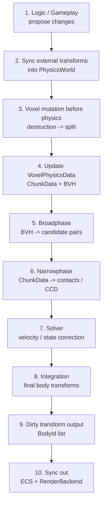

# VoxelEngineDOTS Physics

## Core Idea

游戏世界最终输出的是 `Transform`。

没有物理时，逻辑直接输出 transform；有物理时，逻辑先提出 transform，物理再把它修正到满足碰撞和约束的状态。物理可以被理解为 transform pipeline 中间的一个约束过滤器。

```text
Without Physics:
Logic Transform -> Dirty Entity Transforms -> Render Update

With Physics:
Logic Transform -> Physics Correction -> Dirty Entity Transforms -> Render Update
```

这给 CPU 端 transform 数据流一个很干净的定义：

```text
逻辑端修改 -> 物理端修正 -> dirty entity transforms -> render 更新
```

Render 不需要关心 transform 是逻辑直接修改的，还是被物理修正过的。它只消费最终 transform。

## Runtime Physics Flow

物理模拟本身也应该是一条线性的管线。Voxel mutation 必须发生在物理解算之前，这样 broadphase、narrowphase、solver 都使用最新的物理数据。



## Identity Model

物理核心只认一个身份：

```text
BodyId
```

不要让物理核心同时流动 Unity `Entity`、backend handle、entityId 等多种身份。否则 BVH、ChunkData、solver、render sync 会很快变乱。

推荐模型：

```text
ECS Entity
  has VoxelBodyRef { BodyId, Version }

PhysicsWorld
  BodyId -> BodyState
  BodyId + ChunkPos -> ChunkData
  BVH payload -> BodyId + ChunkPos

EcsBridge
  BodyId -> Entity
  Entity -> BodyId comes from VoxelBodyRef
```

`BodyId` 是物理世界里的唯一主键。Unity `Entity` 只在 ECS bridge / sync boundary 出现。

## PhysicsWorld Ownership

`PhysicsWorld` 是物理模拟的权威数据源。它拥有物理解算高频读写的数据。

```text
PhysicsWorld
  BodyState[]
    Transform
    Velocity
    Collision state / mask
    Mass / inverse mass
    Ground count

  ChunkData
    BodyId + ChunkPos -> chunk payload

  BVH
    spatial query -> BodyId + ChunkPos

  DirtyTransformBodyIds
    bodies whose final transform changed this frame
```

ECS 仍然可以存 transform、velocity、state 的镜像或外部驱动输入，但同一帧内必须有清晰的所有权：

```text
Frame start:
ECS / gameplay external changes -> PhysicsWorld

Frame simulation:
PhysicsWorld owns transform and velocity

Frame end:
PhysicsWorld -> ECS / RenderBackend
```

## ChunkData In, BVH Out

体素物理数据有两个互补方向。

**ChunkData 是入口：**

```text
known BodyId + ChunkPos -> ChunkData -> chunk payload
```

当系统已经知道某个 body 和 chunk 坐标时，直接从 ChunkData 取数据。Narrowphase、destruction、mutation 都走这个方向。

**BVH 是出口：**

```text
ray / AABB / sphere / scene scan -> BVH -> BodyId + ChunkPos
```

当系统不知道哪些 chunk 可能相关时，通过 BVH 的空间结构发现候选。Broadphase 走这个方向。

最核心的数据闭环是：

```text
BVH leaf payload:
BodyId + ChunkPos

Broadphase output:
(BodyIdA + ChunkPosA, BodyIdB + ChunkPosB)

Narrowphase input:
BodyId + ChunkPos -> ChunkData
```

BVH 不判断最终碰撞。BVH 只输出可能碰撞的候选对。

## Simulation Stages

### 1. Broadphase

输入：

- Updated body transforms
- Collision state / mask
- BVH acceleration data

输出：

- Candidate entity pairs
- Candidate chunk pairs

对 voxel physics 来说，最有价值的 broadphase 输出是 chunk pair：

```text
(BodyIdA, ChunkPosA) + (BodyIdB, ChunkPosB)
```

### 2. Narrowphase

输入：

- Broadphase chunk pairs
- ChunkData payloads

流程：

```text
BodyIdA + ChunkPosA -> ChunkDataA
BodyIdB + ChunkPosB -> ChunkDataB
ChunkDataA vs ChunkDataB -> contact points
```

未来 CCD 也应该落在这里：

```text
chunk pair + motion -> earliest contact / time of impact
```

### 3. Solver

输入：

- Contacts
- BodyState
- Mass / inverse mass
- Velocity
- Collision state

输出：

- Corrected velocity
- Corrected state
- Optional position correction

### 4. Integration

输入：

- Solver output
- Velocity
- Delta time

输出：

- Final body transform
- Dirty transform body ids

## Transform Sync

Transform 同步分成两个明确边界。

**Sync In：**

```text
External transform changes
-> BodyId
-> PhysicsWorld.BodyState.Transform
-> update BVH body transform
```

外部修改可以来自 gameplay、editor、teleport、spawn、脚本移动。进入物理模拟之前，它们都要同步到 `PhysicsWorld`。

**Sync Out：**

```text
PhysicsWorld.DirtyTransformBodyIds
-> EcsBridge BodyId -> Entity
-> write ECS transform IComponent
-> update RenderBackend instance transform
```

Frame end 同步只处理 dirty body：

```text
foreach BodyId in DirtyTransformBodyIds:
    Entity = EcsBridge.GetEntity(BodyId)
    Transform = PhysicsWorld.GetTransform(BodyId)
    ECS.SetTransform(Entity, Transform)
    RenderBackend.SetTransform(BodyId, Transform)
```

这是 `O(dirty body count)`，不是 `O(all entities)`。

## ECS Bridge

ECS bridge 是外层适配层，不属于物理核心。

职责：

- 创建 body 后，把 `VoxelBodyRef` 写入 ECS Entity。
- 维护 `BodyId -> Entity`。
- 将外部 ECS transform 修改同步进 PhysicsWorld。
- 将 PhysicsWorld dirty transform 写回 ECS。
- 将最终 transform 同步给 RenderBackend。

物理核心不要在 hot path 里访问 `EntityManager`。

```text
Physics hot path:
BodyId + ChunkPos only

ECS bridge:
BodyId <-> Entity only at sync boundary
```

## Voxel Mutation Before Physics

Voxel content mutation 发生在 physics broadphase 之前。当前主流程只保留两个阶段：

```text
destruction -> split
```

这两个阶段都产出 `command + data`。其中 `data` 是 `8x8x8` bit mask chunk，和真实 `8x8x8` byte voxel chunk 一一对应。

Destruction 和 split 都使用 mask，但语义不同：

- Destruction mask: `0` means remove voxel, `1` means keep voxel.
- Split mask: `1` means copy voxel into the new body, `0` means do not copy.

### 1. Destruction Commands

Destruction 指令先执行。

```text
destruction command + destruction mask
-> group by BodyId + ChunkPos
-> AND masks for the same chunk
-> write final mask into source ChunkData
-> update Ground Count
-> seed BFS / separation detection
-> produce split commands if separated
```

同一个 `BodyId + ChunkPos` 可能同时收到多个 `command + data`。这不需要复杂处理，先把这些 mask 做 `AND`，得到最终 destruction mask，然后再执行一次写入。

这个阶段修改的是原 body 的 chunk 数据。

### 2. Split Commands

Split 在 destruction 之后执行。Split 也使用 `command + data`：

```text
split command:
    from BodyId
    to BodyId
    ChunkPos

split data:
    split mask
```

执行顺序：

```text
main thread create ECS Entity
-> create / bind new BodyId
-> allocate destination chunk memory
-> do not write chunk payload yet
-> source ChunkData + split mask
-> copy masked data into destination chunk
-> update ChunkData and BVH for both bodies
```

也就是说，split 的资源绑定先发生：新的 ECS Entity、新的 `BodyId`、目标 chunk 内存都先准备好。绑定完成后，才通过 `split mask + source chunk` 把数据 copy 到新 chunk 上。

GPU render data is derived from the CPU mutation result:

```text
CPU physics mutation result
-> render backend registration
-> ordered GPU patch stream
```

CPU does not need to keep full render voxel data.

## BVH Dirty Sync Abstraction

BVH is a derived acceleration structure. It should not drive voxel mutation, and voxel mutation should not directly mutate BVH one operation at a time.

The clean abstraction is:

```text
Mutation systems
-> mutate BodyDatabase / ChunkData
-> accumulate dirty body and chunk state
-> flush BVH once from final BodyDatabase state
```

Mutation can happen through many paths:

- destruction mask AND source chunk data
- connectivity readback
- split body creation
- split mask AND source chunk data into new chunks
- body creation / destruction
- chunk creation / removal / bounds changes

All of these should only record dirty state while mutation is running. BVH sync happens after the mutation pipeline reaches a stable final state.

### Structural Sync Before Physics

Voxel structure changes must be flushed before broadphase:

```text
destruction masks
-> mutate source ChunkData
-> connectivity check
-> request new bodies / chunks for split
-> split masks copy data into destination chunks
-> flush structural dirty pool into BVH
-> broadphase can query current body/chunk structure
```

Structural dirty represents:

```text
body created / destroyed
chunk added / removed
chunk local bounds changed
```

BVH should consume final state, not the full history of operations. For example:

```text
add chunk -> remove chunk      => no final BVH chunk
remove chunk -> add chunk      => final BVH chunk exists
destroy body -> recreate slot  => version decides whether old dirty is stale
multiple chunk changes         => refresh body TLAS proxy once
```

The synchronizer should query `VoxelPhysicsBodyDatabase` for the final truth:

```text
Is the body handle still valid?
Does the chunk still exist?
What is the current chunk local AABB?
What is the current body transform?
```

BVH does not need to understand masks, voxel bytes, BFS, split islands, or `ChunkDataContainer<byte>`. BVH only needs final body/chunk spatial state.

### Transform Sync After Physics

Physics solving and integration change transforms, not voxel structure. These changes should be flushed after integration:

```text
broadphase / narrowphase / solve
-> integrate final body transforms
-> collect dirty transform body ids
-> flush transform dirty pool into BVH
-> sync ECS and RenderBackend transforms
```

Transform dirty represents:

```text
body localToWorld changed
```

This sync should only update body-level TLAS proxies. It should not touch chunk data or chunk ownership.

### Two BVH Sync Points

A frame has two separate BVH sync points:

```text
1. Structural BVH sync before physics
   ChunkData / BodyDatabase final mutation state -> BVH body/chunk structure

2. Transform BVH sync after physics integration
   final body transforms -> BVH body world AABBs
```

This keeps the pipeline linear:

```text
Voxel mutation
-> Structural BVH sync
-> Broadphase
-> Narrowphase
-> Solver
-> Integration
-> Transform BVH sync
-> ECS / Render sync
```

The rule is:

```text
BodyDatabase owns existence.
ChunkDataContainer owns voxel bytes.
BVH owns spatial proxies.
Dirty pools describe what must be resynchronized.
Synchronizers translate final authoritative state into derived structures.
```

## Performance Direction

Professional physics engines usually keep their own world data and expose handles to the outside world. This matches the `BodyId -> BodyState` model.

Hot path should be dense and direct:

```text
BodyId.Index -> BodyState[]
BodyId.Index -> chunk metadata
BVH payload -> BodyId + ChunkPos
DirtyTransformBodyIds[] -> sync out
```

Avoid these patterns in hot paths:

- Scanning all ECS entities every frame.
- Writing all transforms back every frame.
- Looking up `EntityManager` during broadphase, narrowphase, or solver.
- Putting Unity `Entity` directly into BVH payload.
- Mixing `Entity`, `entityId`, backend handle, and body handle as different identities.

## Design Rules

- PhysicsWorld only recognizes `BodyId`.
- ECS Entity is an external owner, not a physics identity.
- ChunkData answers known-key reads.
- BVH discovers unknown spatial candidates.
- Broadphase produces candidates, not contacts.
- Narrowphase produces contacts.
- Solver and integration produce final transforms.
- Dirty transforms are generated after physics correction.
- Render consumes final transforms and compact voxel patches.
- Mapping exists only at sync boundaries.
