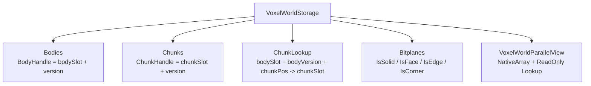

# VoxelWorldStorage

`VoxelWorldStorage` 是全局体素数据容器，只负责存储 body、chunk 和 voxel bitplane，并提供可给 Burst/Jobs 读取的数据视图。



## 数据

- `IsSolid`: 该 voxel 是否存在。
- `IsFace`: 该 voxel 是否是面体素。
- `IsEdge`: 该 voxel 是否是边体素。
- `IsCorner`: 该 voxel 是否是角体素。

标准数据满足：

```text
IsCorner = 1 => IsEdge = 1, IsFace = 1
IsEdge   = 1 => IsFace = 1
```

这不是强制约束，storage 不修正数据。分类判断先看 `IsSolid`：

```text
IsSolid = 0 => Empty, other planes are ignored
IsSolid = 1 => Corner > Edge > Face > Solid
```

例如 `IsSolid = 0` 时，即使 `IsCorner = 1` 也判断为空。`IsSolid = 1` 且 `IsCorner = 1` 时，即使 `IsEdge = 0`、`IsFace = 0`，仍判断为 `Corner`。

## Bit 索引

每个 chunk 固定 `8 x 8 x 8`，每个 bitplane 中一个 chunk 占 `64 bytes`。

```text
lineIndex = y + z * 8
byteIndex = chunkSlot * 64 + lineIndex
mask      = 1 << x
```
