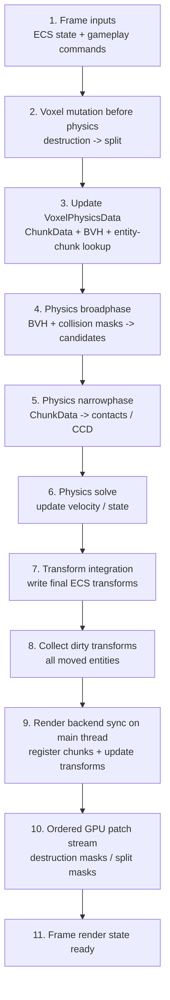

# VoxelEngineDOTS

## Purpose

`VoxelEngineDOTS` aims to redesign `VoxelEngine` with DOTS for high-performance voxel engine runtime and tooling.

## Architecture Overview

`VoxelEngineDOTS` is built around Unity ECS. A `VoxelEntity` represents one voxel object in the world, and each voxel object is split into multiple chunks. ECS entities and components should describe identity, transform, velocity, lifecycle, collision state, and other lightweight physics state; the large voxel payload is stored outside `IComponentData`.

The core reason for this split is data size. Voxel chunks can become very large, so putting raw voxel bytes directly into components would make the ECS archetype data heavy, hard to move, and unsuitable for high-throughput systems. Instead, voxel data is centralized in the physics backend and accessed through a validated body handle plus chunk position.

## Voxel Physics Data

`VoxelPhysicsData` is the centralized physics-side data layer for voxel objects. Its responsibility is to provide the data needed by physics systems, not to become a complete gameplay object model.

The current architecture keeps this layer intentionally small. `VoxelPhysicsData` only needs:

- BVH data for broadphase and filtered candidate discovery.
- ChunkData for narrowphase reads.
- Lookup from `VoxelPhysicsBodyHandle` and chunk coordinate to chunk data.

Everything else should stay in ECS components, physics systems, or higher-level managers unless it is required to answer physics queries efficiently.

Physics state such as velocity, dynamic/static classification, and other per-entity simulation values belongs on the ECS entity as `IComponentData`. `VoxelPhysicsData` should not duplicate that state unless a cached copy is required for query performance or synchronization.

1. **BVH**
   - Stores spatial acceleration data for voxel entities and their chunks.
   - Supports broadphase queries such as ray, AABB, sphere, and other spatial query shapes.
   - Supports filtered candidate discovery by collision state or mask. For example, a voxel object may be `Grounded`, `Stable`, or `Dynamic`; `Dynamic` can collide with all types, while other combinations can be filtered by policy.
   - Can be used by a BVH manager or collision broadphase system to find all potentially colliding entities in the scene under a given filter.
   - Because a `VoxelEntity` contains chunks, BVH output often needs to go beyond entity pairs and produce chunk pairs for narrowphase.
   - The current dynamic implementation is represented by `VoxelPhysicsDynamicBvhContainer`.

2. **ChunkData**
   - Stores the raw per-chunk voxel physics payload.
   - Maps `(VoxelPhysicsBodyHandle, chunkPosition)` to a compact `chunkDataId`.
   - Provides the data needed by narrowphase to test chunk A against chunk B and locate concrete contact points.
   - This is where precise voxel-to-voxel collision tests and future CCD contact searches should read their source data.
   - The current backend stores bodies in `NativeList<VoxelPhysicsBody>`, each body's chunks in `NativeList<VoxelPhysicsChunk>`, each body's chunk lookup in `NativeHashMap<int3, int>`, and raw voxel bytes in `ChunkDataContainer<byte>`.

## Runtime Data Flow

The runtime flow should be linear. Voxel content mutation runs before physics solving so broadphase, narrowphase, and simulation all consume the newest `VoxelPhysicsData`.

1. **Frame Inputs**
   - ECS components provide transform, velocity, collision state, and masks.
   - Gameplay or tools may submit destruction commands, split requests, or direct transform changes.

2. **Voxel Mutation Before Physics**
   - Destruction reads `VoxelPhysicsData` and generates `DestructionMaskChunk` data.
   - A real chunk is `8x8x8` bytes; a destruction mask is an `8x8x8` bit mask where `0` removes a voxel and `1` keeps it.
   - Multiple destruction masks for the same chunk are combined with `AND`, then applied to `ChunkData`.
   - Split runs after destruction and uses `split mask + source chunk` to copy data into newly allocated chunks.

3. **Update VoxelPhysicsData**
   - Mutated chunks update `ChunkData`.
   - Removed voxels update `Ground Count`.
   - Destroyed points seed parallel BFS for separation detection.
   - Split masks create new voxel entities with `original chunk data AND split mask`.
   - Body-chunk lookup and BVH entries are updated for original and new bodies.

4. **Physics Broadphase**
   - BVH queries use the updated physics data.
   - Collision masks such as `Grounded`, `Stable`, and `Dynamic` filter candidate discovery.
   - Output is still only candidates: entity hits, entity pairs, chunk hits, or chunk pairs.

5. **Physics Narrowphase**
   - Candidate chunk pairs resolve through `VoxelPhysicsBodyHandle + chunkPosition`.
   - The body database returns `chunkDataId`.
   - `ChunkDataContainer<byte>` returns chunk slices.
   - Narrowphase finds contact points; future CCD should find earliest contact or time of impact here.

6. **Physics Solve**
   - Contacts update ECS physics state such as velocity, grounded/stable/dynamic state, and other per-entity simulation values.
   - Large voxel payload stays in `VoxelPhysicsData`; lightweight simulation state stays in `IComponentData`.

7. **Transform Integration**
   - Integration writes the final ECS transform for the frame.
   - Movement can come from physics or any other system.
   - Any changed transform marks the entity dirty.

8. **Render Backend Sync**
   - Main thread consumes new entity/chunk registrations and dirty transforms.
   - Registration maps an entity chunk or AABB to a render chunk handle without uploading `ChunkData`.
   - Dirty render instances update their transforms one by one.

9. **GPU Patch Stream**
   - CPU render patches are derived from the already-mutated physics data.
   - Destruction uploads `8x8x8` bit masks plus instruction type.
   - Split uploads `split mask + entity from/to` and writes `source chunk AND split mask` into the destination chunk.
   - Patch order must match CPU mutation order for the same chunk.
   - CPU does not keep full render voxel data; GPU render data is derived state.

## Current Direction

The current direction is:

- ECS owns object identity, scheduling, and system orchestration.
- ECS `IComponentData` owns per-entity physics state such as transform, velocity, and collision state.
- `VoxelPhysicsData` owns large physics-side voxel storage.
- BVH owns broadphase spatial acceleration and collision candidate discovery.
- ChunkData owns raw chunk payload storage and lookup for narrowphase.
- Body-to-chunk lookup is enough for the centralized data layer as long as ECS carries the remaining lightweight state and the ECS side stores the body handle.
- Voxel mutation runs before physics solve.
- Destruction flows through masks first, then mutates ChunkData after masks are combined.
- Split runs after destruction, then copies masked source chunk data into newly allocated chunks.
- BVH is updated from dirty structural state after voxel mutation and from dirty transform state after physics integration.
- Physics solve runs after VoxelPhysicsData is already updated.
- GPU render data receives compact patch commands instead of full chunk uploads.
- Render backend registration maps entity chunks to GPU chunk handles before GPU patch commands execute.
- Transform changes flow through a dirty transform list and update render instance transforms on the main thread.

## Open Design Questions

- The CCD/narrowphase algorithm is not finalized.
- BVH filtering needs a concrete representation for collision state or mask, such as `Grounded`, `Stable`, and `Dynamic`.
- The broadphase API should make it clear whether a query returns entity hits, entity pairs, chunk hits, or chunk pairs.
- Narrowphase needs a stable contract for consuming chunk pairs and returning contact points or time-of-impact results.
- `DestructionMaskChunk` needs a concrete memory layout and lifetime policy.
- Split detection needs a concrete BFS scheduling strategy and a stable contract for producing split masks.
- Splitting needs exact ownership rules for updating the original entity, new entities, BVH entries, chunk lookup, and ECS components.
- GPU patch commands need explicit ordering, versioning, and synchronization rules so destruction and split patches cannot observe stale chunk mappings.
- Dirty transform sync needs a concrete representation, deduplication policy, and ordering relative to render backend registration.

This README is the high-level map. More detailed notes can be added under `Physics/`, `Render/`, and subsystem-level READMEs as the implementation grows.
