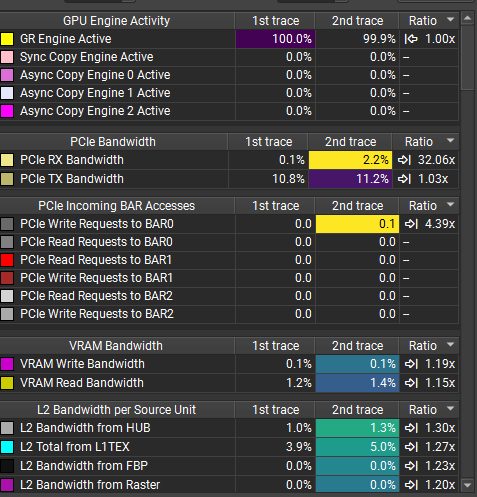
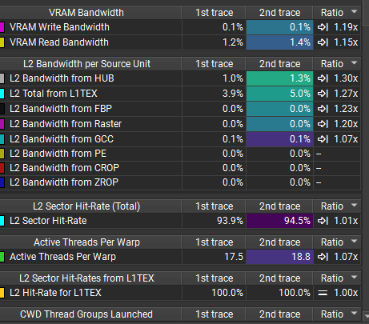
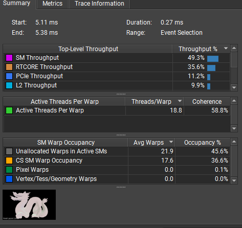
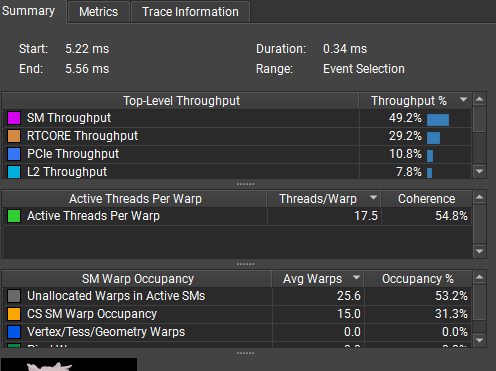

# RayTracingShaders Octant

`VoxelOccupancyProceduralOctant` keeps the traversal shape aligned with the Linear shader:

- traversal is still single-layer, voxel-by-voxel DDA
- occupancy layout changes to `small_octant` bytes (`2x2x2` voxels per byte)
- the current implementation keeps a `medium_octant` occupancy cache in registers while traversal remains voxel-by-voxel

## Final Conclusion

For the current `8x8x8` chunk setup, the `Octant` implementation is slower than `Linear`, and the latest `DispatchRays`-scoped Nsight comparisons do not show a compensating memory-side advantage.

The practical conclusion is:

- `Linear` is the better implementation for the current chunk size
- the current `Octant` path does not provide a validated performance win
- earlier broad-trace or percentage-only readings were not sufficient; the final judgment should be based on `DispatchRays`-scoped comparison

## What The Latest Profiling Shows

When the compare is scoped to the `DispatchRays` event itself, `Linear` wins across the important metrics:

- `DispatchRays` duration: `Linear 0.27 ms`, `Octant 0.34 ms`
- active threads / warp: `Linear 18.8`, `Octant 17.5`
- coherence: `Linear 58.8%`, `Octant 54.8%`
- CS SM warp occupancy: `Linear 36.6%`, `Octant 31.3%`
- L2 total from L1TEX: `Linear 5.0%`, `Octant 3.9%`
- L2 sector hit rate: `Linear 94.5%`, `Octant 93.9%`
- VRAM read bandwidth: `Linear 1.4%`, `Octant 1.2%`

That means the current `Octant` path is not just losing on divergence and occupancy. In the final scoped comparison, it also fails to show a meaningful memory-side win.

## Interpretation

The best current reading is:

- this is not simply "path divergence beat memory divergence"
- it is closer to "`Octant` adds extra SM-side work, lowers warp quality / occupancy, and still does not buy enough memory efficiency to matter"
- in the current implementation, the cache/decode strategy costs more than it saves

So for this project, the correct baseline assumption is:

- `Linear` is the preferred layout for `8x8x8`
- `Octant` should be treated as an experiment, not as an optimization

## Representative Nsight Captures

Latest `DispatchRays`-scoped compare captures:

### Trace Compare Part 1

### Trace Compare Part 2

Event-level `Summary / Metrics` captures from the same investigation:

### Linear Summary / Metrics

### Octant Summary / Metrics

## Practical Guidance

- Do not assume that a more hierarchical or Morton-like occupancy layout is automatically faster.
- For this chunk size, reducing occupancy loads alone is not enough.
- Any future `Octant` attempt should be judged against `Linear` using `DispatchRays`-scoped profiling, not broad frame-level counters.
