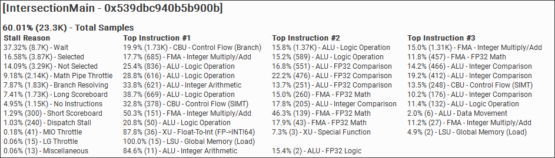
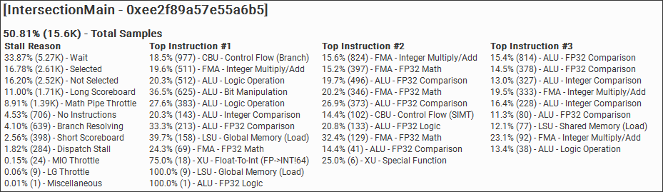

# RayTracingShaders Octant

`VoxelOccupancyProceduralOctant` keeps the DDA traversal shape aligned with the Linear shader:

- traversal is still single-layer, voxel-by-voxel DDA
- occupancy layout changes to `small_octant` bytes (`2x2x2` voxels per byte)
- the current implementation keeps a `medium_octant` occupancy cache in registers while traversal remains voxel-by-voxel

## Current Conclusion

In the current `8x8x8` chunk setup, the Octant path appears to be slower than the Linear path in practice.

This is not treated as a bug by default. The current explanation is:

- Linear occupancy for one chunk is only `64 bytes`, so repeated loads are often cheap and likely to stay cache-friendly.
- Linear address decode is extremely cheap: fixed `(y, z)` row byte plus `x` bit test.
- Octant can reduce memory-related waits, but every step still pays extra state-update cost: octant-local index maintenance, cached-byte extraction, and boundary bookkeeping.
- Moving the cache from `small_octant` to `medium_octant` lowers `Long Scoreboard` further, but the saved memory wait is replaced by more ALU and branch/control cost.
- Branchless updates improve the medium-cache version somewhat, but the total sample cost of `IntersectionMain` still stays well above Linear.
- The Octant memory order is less straightforward than the Linear row layout, which can reduce coherence across nearby rays.

Because of that tradeoff, Octant can lose even when it performs fewer global occupancy loads.

## Profiling Notes

Recent Nsight Graphics profiling on the current implementation shows a consistent pattern:

- `Octant` reduces `Long Scoreboard` compared to `Linear`, so occupancy caching is doing its intended memory-side job.
- `Octant` still increases total `IntersectionMain` samples, which points to extra compute/control work rather than a memory bottleneck.
- The main cost shifts toward:
  - more integer / logic / bit-manipulation instructions
  - more bookkeeping to maintain cached octant state
  - somewhat higher branch resolving / lower coherence

This means the current optimization path is likely near its limit for `8x8x8` chunks. Further hierarchy-aware caching may continue to reduce memory wait, but is unlikely to beat `Linear` unless it also reduces per-step control and ALU overhead substantially.

## Representative Nsight Captures

Representative `IntersectionMain` captures from one of the profiling runs are included below as visual evidence for the tradeoff described above.

### Octant

### Linear

## Practical Interpretation

For this project, do not assume that a more hierarchical or Morton-like occupancy layout is automatically faster.

The current evidence suggests:

- `Linear` is a very strong baseline for `8x8x8` chunks
- reducing occupancy loads alone is not enough
- extra ALU, register pressure, and divergence can outweigh the memory benefit

Any future Octant optimization should be validated against Linear with profiling, not inferred from layout complexity alone.
